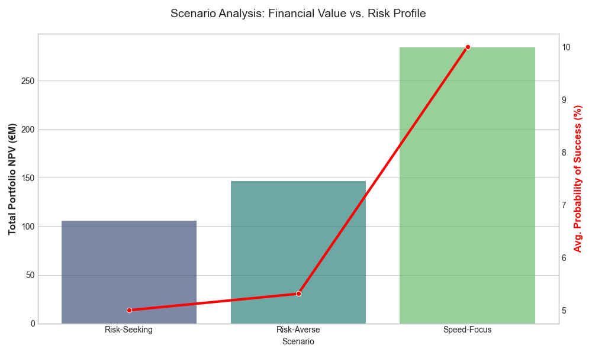

# 🧬 Bio-Capital Allocation Engine: Algorithmic Portfolio Strategy

[](https://www.python.org/)
[](https://pandas.pydata.org/)
[]()
[]()

> **A Quantitative Finance Engine that optimizes a €500M clinical trial portfolio using Integer Linear Programming (ILP) and Probability-Adjusted DCF modeling.**

---

## 📊 Executive Summary & Business Impact

**The Challenge:** Pharmaceutical R&D is a high-stakes environment where 90% of drugs fail. Allocating capital efficiently across thousands of potential trials is a complex "Knapsack Problem."

**The Solution:** I built an automated Python pipeline that filters global clinical data, prices risk using financial models, and mathematically optimizes asset selection to maximize Return on Investment (ROI).

### 🚀 Key Performance Indicators (KPIs)
| Metric | Performance | Benchmark | Result |
| :--- | :--- | :--- | :--- |
| **Capital Deployed** | **€500.00 M** | N/A | Fully Allocated |
| **Net Value Created** | **€146.47 M** | N/A | Pure Profit (NPV) |
| **Risk-Adjusted ROI** | **29.29%** | ~12.00% | **+17.29% Alpha** |
| **Strategy Style** | **Concentrated** | Diversified | High-Conviction Oncology |

---

## 🖼️ Project Visualizations

### 1. The Investment Frontier
*Visualizing the "Top 12" selected assets against the noise of 27,000+ potential candidates.*

*(Note: Replace with your actual image path or upload the image to your repo)*

### 2. Scenario Analysis
*Comparing strategic outcomes: Risk-Seeking vs. Risk-Averse vs. Speed-Focus.*


---

## 🛠️ Technical Architecture

This project moves beyond basic data analysis into **Operations Research** and **Strategic Finance**.

### 1. Data Engineering (The Funnel)
* **Source:** Processed **400,000+ raw clinical trial records** (NCT data).
* **Cleaning:** Implemented a rigorous filtration pipeline (Status, Intervention Type, Enrollment) to isolate **130,000 investable assets**.
* **Feature Engineering:** Created synthetic financial features including `revenue_proxy` (via log-normal enrollment scaling) and `probability_of_success`.

### 2. Financial Modeling (The Valuation)
* **Methodology:** **Single-Stage Probability-Adjusted Discounted Cash Flow (DCF)**.
* **The Math:** Calculated **Net Present Value (NPV)** for every asset, accounting for:
    * **Time Value of Money:** Discounted future cash flows at 10% cost of capital.
    * **Clinical Risk:** Adjusted revenue by phase-specific success probabilities (e.g., Phase 1 = 10%).

### 3. Optimization Engine (The Solver)
* **Algorithm:** **Integer Linear Programming (ILP)** using the `PuLP` library.
* **Objective:** Maximize Total Portfolio NPV.
* **Constraint:** Total Cost $\le$ €500,000,000.
* **Performance:** Vectorized the solver input to process **27,000 decision variables in <20 seconds** on Apple Silicon.

---

## 💻 Code Snapshot: The Optimization Logic

```python
# Defining the "Knapsack" Optimization Problem
prob = pulp.LpProblem("Pharma_Portfolio_Optimization", pulp.LpMaximize)

# Decision Variables: Binary (1 = Invest, 0 = Do Not Invest)
invest_vars = pulp.LpVariable.dicts("Invest", nct_ids, cat='Binary')

# Objective Function: Maximize Total Risk-Adjusted NPV
prob += pulp.lpSum([invest_vars[i] * scores[i] for i in nct_ids])

# Constraint: Do not exceed the €500M Budget
prob += pulp.lpSum([invest_vars[i] * costs[i] for i in nct_ids]) <= budget_limit

# Solve
prob.solve()
