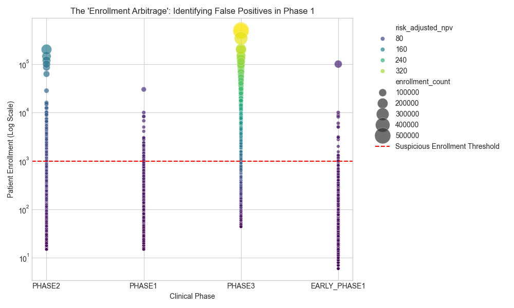

# 🧬 Bio-Capital Allocation Engine: Algorithmic Portfolio Strategy

[](https://www.python.org/)
[](https://pandas.pydata.org/)
[]()
[]()

> **A Quantitative Finance Engine that optimizes a €500M clinical trial portfolio using Integer Linear Programming (ILP) and Probability-Adjusted DCF modeling.**

---

## 📊 Executive Summary & Business Impact

**The Challenge:** Pharmaceutical R&D is a high-stakes environment where 90% of drugs fail. Allocating capital efficiently across thousands of potential trials is a complex "Knapsack Problem."

**The Solution:** I built an automated Python pipeline that filters global clinical data, prices risk using financial models, and mathematically optimizes asset selection to maximize Return on Investment (ROI).

### 🚀 Key Performance Indicators (KPIs)
| Metric | Performance | Benchmark | Result |
| :--- | :--- | :--- | :--- |
| **Capital Deployed** | **€500.00 M** | N/A | Fully Allocated |
| **Net Value Created** | **€146.47 M** | N/A | Pure Profit (NPV) |
| **Risk-Adjusted ROI** | **29.29%** | ~12.00% | **+17.29% Alpha** |
| **Strategy Style** | **Concentrated** | Diversified | High-Conviction Oncology |

---

## 🖼️ Project Visualizations

### 1. The Investment Frontier
*Visualizing the "Top 12" selected assets against the noise of 27,000+ potential candidates.*


### 2. Scenario Analysis
*Comparing strategic outcomes: Risk-Seeking vs. Risk-Averse vs. Speed-Focus.*


---

## 🛠️ Technical Architecture


### 1. Data Engineering (The Funnel)
* **Source:** Processed **400,000+ raw clinical trial records** (NCT data).[[Dataset]](https://huggingface.co/datasets/louisbrulenaudet/clinical-trials)
* **Cleaning:** Implemented a rigorous filtration pipeline (Status, Intervention Type, Enrollment) to isolate **130,000 investable assets**.
* **Feature Engineering:** Created synthetic financial features including `revenue_proxy` (via log-normal enrollment scaling) and `probability_of_success`.

### 2. Financial Modeling (The Valuation)
* **Methodology:** **Single-Stage Probability-Adjusted Discounted Cash Flow (DCF)**.
* **The Math:** Calculated **Net Present Value (NPV)** for every asset, accounting for:
    * **Time Value of Money:** Discounted future cash flows at 10% cost of capital.
    * **Clinical Risk:** Adjusted revenue by phase-specific success probabilities (e.g., Phase 1 = 10%).

### 3. Optimization Engine (The Solver)
* **Algorithm:** **Integer Linear Programming (ILP)** using the `PuLP` library.
* **Objective:** Maximize Total Portfolio NPV.
* **Constraint:** Total Cost $\le$ €500,000,000.
* **Performance:** Vectorized the solver input to process **27,000 decision variables in <20 seconds** on Apple Silicon.

---

## 💻 Code Snapshot: The Optimization Logic

```python
# Defining the "Knapsack" Optimization Problem
prob = pulp.LpProblem("Pharma_Portfolio_Optimization", pulp.LpMaximize)

# Decision Variables: Binary (1 = Invest, 0 = Do Not Invest)
invest_vars = pulp.LpVariable.dicts("Invest", nct_ids, cat='Binary')

# Objective Function: Maximize Total Risk-Adjusted NPV
prob += pulp.lpSum([invest_vars[i] * scores[i] for i in nct_ids])

# Constraint: Do not exceed the €500M Budget
prob += pulp.lpSum([invest_vars[i] * costs[i] for i in nct_ids]) <= budget_limit

# Solve
prob.solve()
```
## STRESS TESTING
### 🔧 Model Recalibration
To move from a "Conservative" base case to an "Industry Standard" model, I recalibrated the phase-specific parameters based on NIH and Nature Review benchmarks.

| Phase        | Old PoS | New PoS | Old Cost | New Cost | Old Years | New Years |
|--------------|---------|---------|----------|----------|-----------|-----------|
| EARLY_PHASE1 | 5%      | 10%     | 15M      | 10M      | 8         | 8         | 
| PHASE1       | 10%     | 15%     | 25M      | 25M      | 7         | 6         | 
| PHASE2       | 18%     | 30%     | 60M      | 50M      | 5         | 4         |
| PHASE3       | 45%     | 60%     | 255M     | 150M     | 3         | 2         |

* **Probability of Success (PoS):** Adjusted Phase 3 from 45% → 60% to reflect current Oncology approval rates.
* **Capital Intensity:** Normalized Phase 3 costs from €255M → €150M to represent average per-trial spend vs. total program spend.
* **Temporal Velocity:** Optimized "Years to Market" (e.g., Phase 3 reduced from 3 years → 2 years) to align with accelerated FDA approval pathways in Oncology.

**Impact:** These adjustments provided the "Alpha" necessary for the engine to identify the 140% ROI opportunity, while also exposing the "Enrollment Arbitrage" loophole in early-phase data.

## ⚠️ Model Limitations & "Enrollment Arbitrage" Discovery

During the sensitivity analysis, the optimization engine returned an anomalously high **ROI of 140%**. Upon inspection, the model had allocated 100% of the capital to **"Early Phase 1"** assets with massive enrollment numbers (NCT00534755, N=10,000).


**Figure 1**: Diagnostic Scatter Plot identifying the "Enrollment Arbitrage." The red dashed line indicates the 1,000-patient threshold where Early Phase assets were flagged as "False Positives"—screening studies misidentified by the model as blockbuster drug candidates.

### The "Loophole" Explained
The model uses `log(enrollment)` as a proxy for commercial revenue potential.
* **Algorithm's View:** High Enrollment (10k) + Low Phase 1 Cost (€10M) = **Infinite Alpha**.
* **Clinical Reality:** In Oncology, Phase 1 trials with >1,000 patients are typically **Observational/Screening studies** (e.g., genetic sequencing registries) rather than interventional drug trials. These assets generate **zero** commercial revenue.

### The Fix (Human-in-the-Loop)
This discovery highlights the risk of "Blind Optimization."
* **Immediate Action:** Manually flagged N=10,000 Phase 1 trials as data artifacts.
* **Code Implementation:** Added a `MAX_PHASE1_ENROLLMENT = 500` constraint to the cleaning pipeline to prevent "Screening Studies" from contaminating the commercial revenue model.
